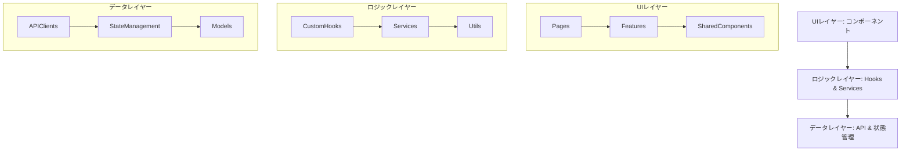
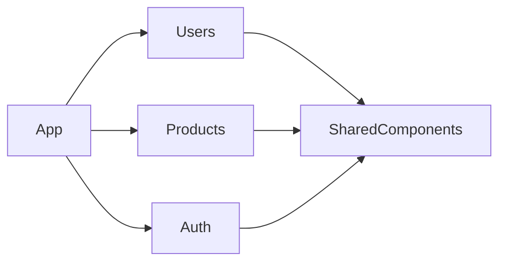
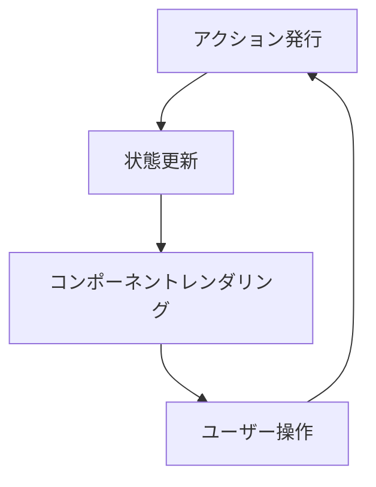
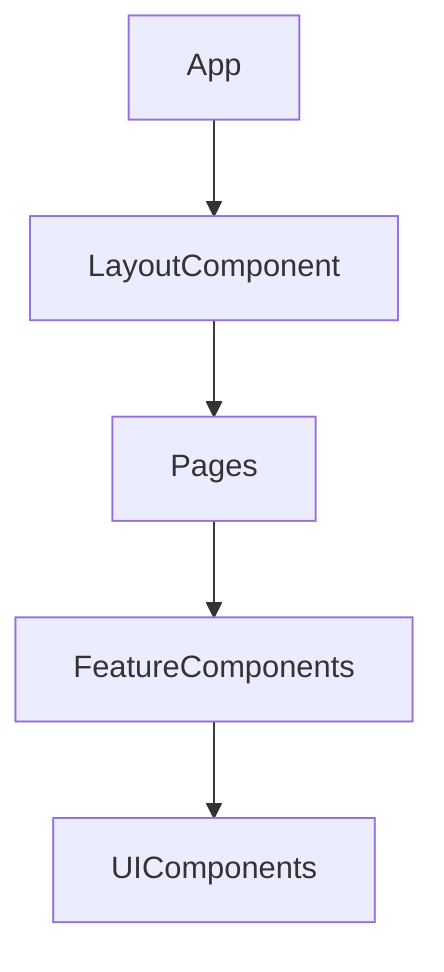
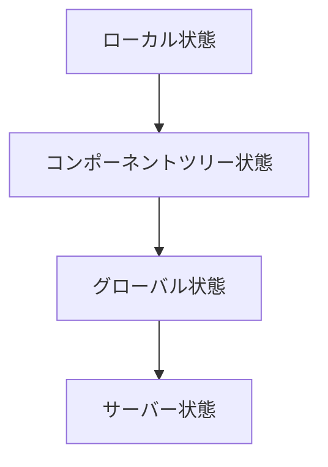

# Bulletproof React システムパターン

## システムアーキテクチャ

Bulletproof React は、機能モジュール化とクリーンアーキテクチャの原則に基づいた構造を採用します。



## 主要な技術的決定

### 1. 機能ベースのモジュール化

各機能は自己完結した単位として実装し、機能間の依存関係を明示的に管理します。



### 2. コンポーネントの分類

- **UI コンポーネント**: 純粋に表示を担当（Button, Card, Input）
- **コンテナコンポーネント**: データとロジックを管理（UserList, ProductForm）
- **ページコンポーネント**: ルートに対応する大きな単位（Dashboard, UserProfile）
- **レイアウトコンポーネント**: ページの構造を定義（MainLayout, SidebarLayout）

### 3. データフロー

単方向データフローとイミュータブルな状態管理を採用します：



### 4. API 通信パターン

- React Query を使用したデータフェッチング
- エラーハンドリングの集中管理
- ローディング状態の統一管理
- オフライン対応と楽観的 UI 更新

## 使用されるデザインパターン

### 1. カスタムフック

ロジックの再利用と関心の分離を実現します。

```typescript
// 例: 認証情報の管理
function useAuth() {
  const [user, setUser] = useState<User | null>(null);
  const [loading, setLoading] = useState(true);
  const [error, setError] = useState<Error | null>(null);

  // ログイン、ログアウト、認証チェックのロジック

  return {
    user,
    loading,
    error,
    login,
    logout,
    isAuthenticated: !!user,
  };
}
```

### 2. Compound Components

関連するコンポーネントをグループ化し、明示的な API を提供します。

```tsx
// 使用例
<Tabs defaultValue="profile">
  <Tabs.List>
    <Tabs.Trigger value="profile">プロフィール</Tabs.Trigger>
    <Tabs.Trigger value="settings">設定</Tabs.Trigger>
  </Tabs.List>
  <Tabs.Content value="profile">プロフィール内容</Tabs.Content>
  <Tabs.Content value="settings">設定内容</Tabs.Content>
</Tabs>
```

### 3. 高階コンポーネント (HOC)

共通のロジックをコンポーネント間で共有します。

```typescript
// 例: 認証保護コンポーネント
function withAuth<P extends object>(Component: ComponentType<P>) {
  return function AuthenticatedComponent(props: P) {
    const { user, loading } = useAuth();

    if (loading) return <Loader />;
    if (!user) return <Navigate to="/login" />;

    return <Component {...props} />;
  };
}
```

### 4. アダプタパターン

外部 API データを内部モデルに変換します。

```typescript
// APIレスポンス型
interface UserApiResponse {
  id: string;
  first_name: string;
  last_name: string;
  email_address: string;
}

// アプリケーション内部モデル
interface User {
  id: string;
  fullName: string;
  email: string;
}

// アダプタ関数
function mapApiUserToModel(apiUser: UserApiResponse): User {
  return {
    id: apiUser.id,
    fullName: `${apiUser.first_name} ${apiUser.last_name}`,
    email: apiUser.email_address,
  };
}
```

## コンポーネントの関係性

### 1. コンポーネント階層



### 2. 状態共有パターン

状態はできるだけ最小限の範囲で管理し、必要に応じて適切な粒度で共有します。

- **コンポーネント内ローカル状態**: useState, useReducer
- **コンポーネントツリー内共有**: Context API
- **グローバル状態**: Jotai アトム
- **サーバー状態**: TanStack Query



### 3. コンポーネント通信

- **Props Down**: 親から子へのデータ伝達
- **Events Up**: 子から親への通知
- **Context**: 深い階層間の共有データ
- **Global State**: コンポーネント間の共有状態

### 4. テスト駆動コンポーネント設計

各コンポーネントはテスト駆動で設計・開発され、以下の観点でテストされます：

- **単体テスト**: コンポーネントの独立した機能
- **統合テスト**: 複数コンポーネントの連携
- **ストーリーテスト**: Storybook との連携
- **アクセシビリティテスト**: a11y コンプライアンス

## 拡張性と保守性

本システムは以下の原則に基づき拡張性と保守性を確保します：

1. **機能の明確な境界**: 各機能は独立して開発・テスト可能
2. **型安全性**: TypeScript による厳格な型チェック
3. **テスト駆動**: すべての機能はテストで検証
4. **一貫したコード規約**: ESLint, Prettier による標準化
5. **パフォーマンス最適化**: メモ化、遅延ロード、仮想化技術の活用

## マイグレーション戦略

既存のコードから本アーキテクチャへの移行は以下の手順で行います：

1. 共有コンポーネントの抽出と型付け
2. 機能モジュールへの段階的な分割
3. テストの整備
4. 状態管理の統一
5. API クライアント層の抽象化

## リスクと軽減策

| リスク                 | 軽減策                             |
| ---------------------- | ---------------------------------- |
| 過剰な抽象化           | コンポーネント設計の定期的な見直し |
| バンドルサイズの肥大化 | コード分割と遅延ロードの活用       |
| 学習曲線の急勾配       | 詳細なドキュメントと例の提供       |
| TypeScript の複雑さ    | 段階的な型システムの導入           |
